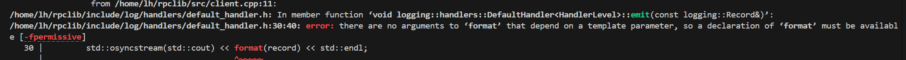
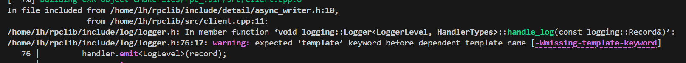

1. 模板的名字查找问题

模板中的无限定查找分为两类：
    不是待决类型的 -- 在第一次检查时需要通过（检查模板本身的定义）
        若是非待决类型 -- 是查找不到待决的基类中的名字的
    是待决类型的 -- 推迟到第二次检查（模板实参已确定）
2. 
template用以指明后面是依赖模板类型参数的模板 消除歧义 -- 与typename功能类似
3. 在进入初始化函数体之前 要确保所有的成员都已经构造好了  初始化函数体只是调整变量的状态
4. 声明时声明了默认参数的值 定义时就不能写了
5. 赋值运算符最后需要返回自己的引用
6. 在类外实现模板的全特化需要声明为inline -- 全特化貌似不隐式inline
7. "aka" 是 "also known as" 的缩写 -- 后面的内容可能更好懂
8. 先启动的进程无法收到res 也无法正常退出 -- notify向未启动的的server发送消息失败时 应该将其从write_queue_中弹出

1. 一有连接就抛出bad_weak_ptr异常  -- 是因为私有继承了std::enable_shared_from_this
std::enable_shared_from_this实现
2. 在dispatcher.cpp的data中抛出  what():  std::bad_cast -- lambda引用不会+异步导致悬垂引用  （怎么解决logger不能复制的问题呢） 
3. 当一个头文件被多个源文件包含时，如果在头文件中定义了静态变量（例如：static int logger_;），则每个源文件都会生成一个该变量的实例，最终在链接时会出现多重定义错误。
一般在头文件中声明静态成员变量，而在对应的源文件中进行定义和初始化